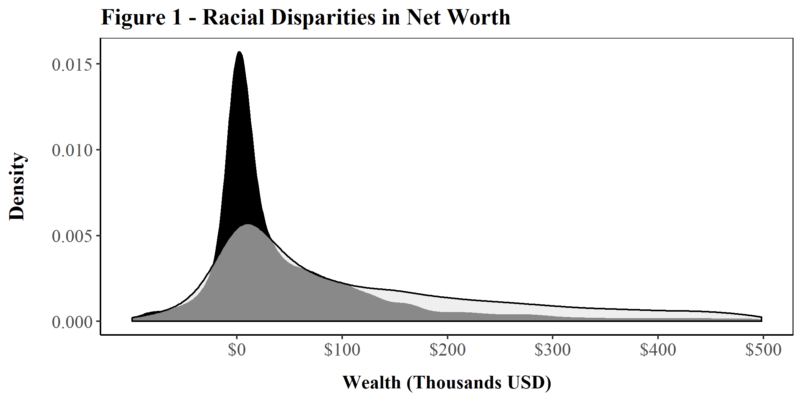

# Health and Wealth

  

# Overview
This repository was written in 2017-2018. It examines the relationship between health and wealth using the Panel Study of Income Dynamics. It contributes to three interrelated projects, all of which examine how the health wealth relationship is mediated by one's race, asset allocation, and socio-economic strata with longitudinal modeling approaches (e.g. fixed effects models, mixed effects/growth models).

# Usage
This repository was built only for personal use, so it requires a few steps for migrating to a new computer. New users must first:
- Download all years of the PSID family files, cross sectional individual files, and auxiliary wealth files.
- Change all directories to those on the user's disk.
- Install all required libraries used in the repository.
- Run all scripts within the "Code" directory in the order of their numerical prefixes. Scripts without a numerical prefix should be run after scripts with numerical prefixes are run. 

# Details
Below is a brief overview of what each script does.

- **1 - Prep Data.R**
    - Unzips raw PSID data.
    - Imports data into R format.
    - Gives longitudinal variables consistent names.
    - Merges wealth files into family files.
- **2 - Prepare family variables.R**
    - Creates longitudinal dataset with select variables from each wave of the family files.
    - Reformats changes in variables over time.
    - Renames variables.
- **3 - Prepare Individual Vars.R**
    - Cleans and accounts for changes in individual-level variables over time
- **4 - Merge Individual Vars.R**
    - Merges individual and family-level datasets
- **5 - Reduce Sample.R**
    - Changes spouse-level variables to consistent names that correspond to individual-level data.
    - Reduce sample by years, age, household status, race, and coverage
    - Add a few derived variables
    - Inflate financial variables with Consumer Price Index
- **6 - Descriptive statistics.R**
    - Generate descriptive statistics of all core variables.
- **7 - Models.R**
    - Create lagged variables/account for censorship of deceased.
    - Make final tweaks to clean data
    - Estimate mixed effects models for each dependent variables
    - Partially format results
- **8 - Format results.R**
    - Further format results for publication
- **9 - Standardize Variables.R**
    - Standardize variables for modeling
- **Ap1 - Health by Race.R**
    - Create bar plots of race differentials in health
- **Ap2 - Wealth by Race.R**
    - Create bar plots of race differentials in asset allocation
- **Fig 1 - Racial Disparities of Wealth.R**
    - Create density plot of race disparities in wealth 
- **Fig 2,3,4 - Parameter Estimates and Predicted Values.R**
    - Create multi-grid scatter plot visualizing parameter estimates for key independent variables by dependent variable
    - Create multi-grid line plot visualizing predicted health for individuals based on changing parameter estimates for key independent variables by each dependent variable
